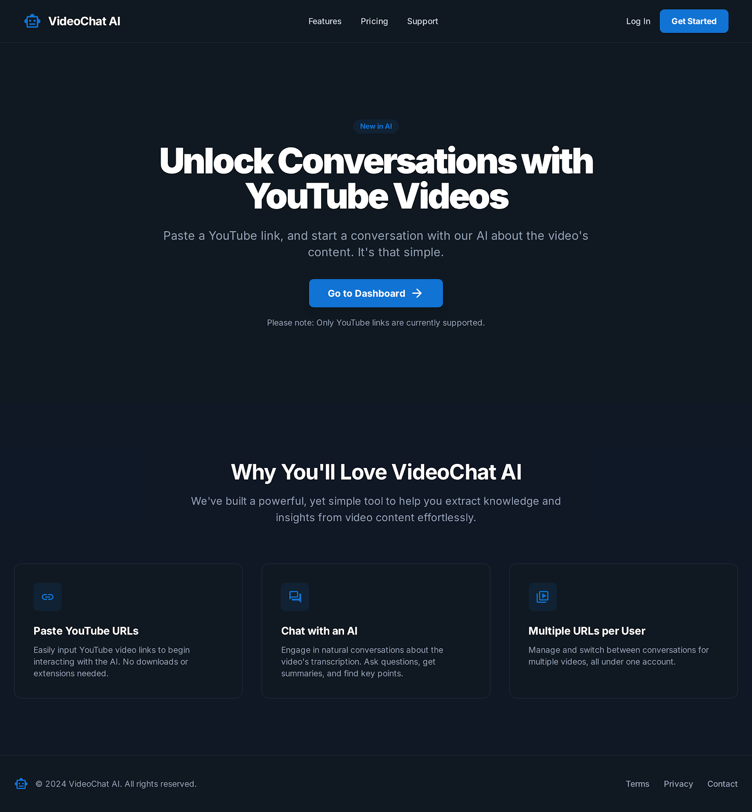
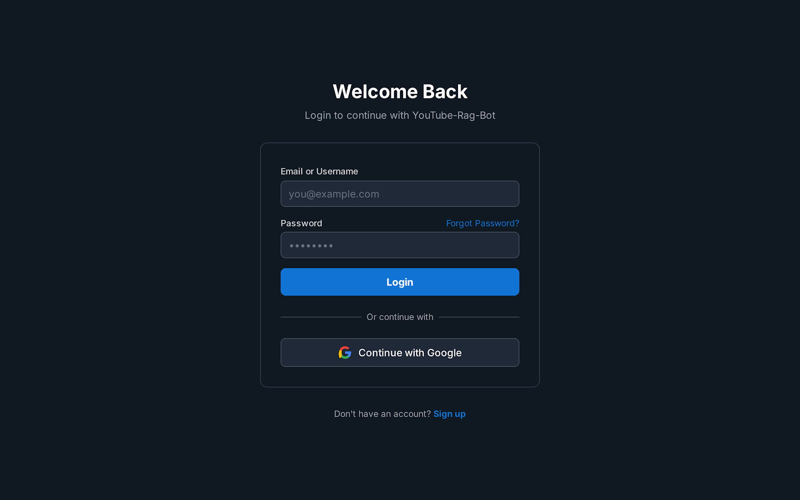
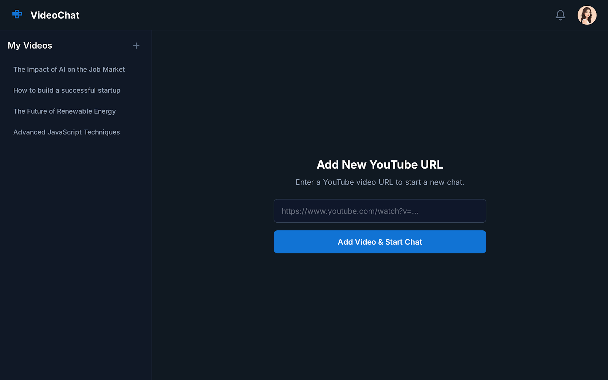
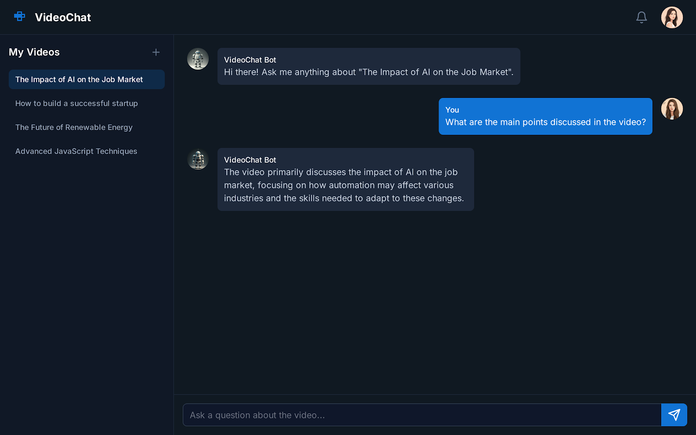
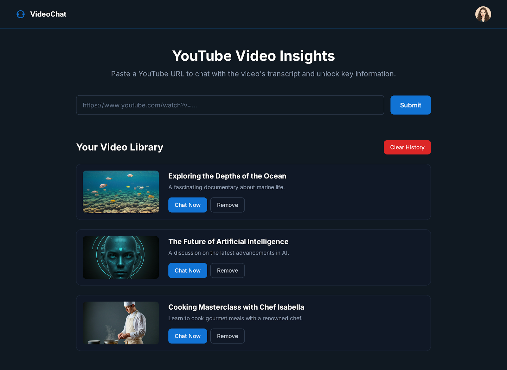
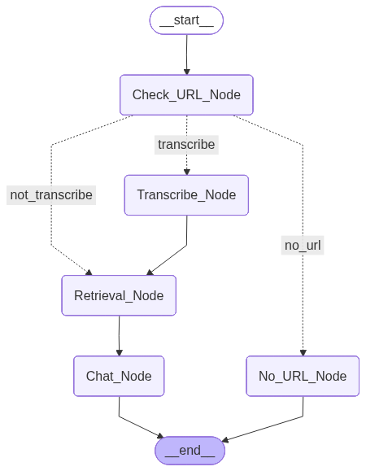

# YouTube RAG Chatbot with LangGraph

An advanced **Retrieval-Augmented Generation (RAG)** chatbot built using **LangGraph**, **FastAPI**, and **PostgreSQL**.  
This application enables users to extract meaningful insights and engage in intelligent conversations based on the content of **YouTube videos**.  

Simply provide a YouTube video URL  the system retrieves, processes, and analyzes its transcript, allowing seamless interaction through a natural language interface powered by **Large Language Models (LLMs)**.

---

##  Features

- **LangGraph-powered pipeline** for modular chat workflows  
- **Automatic YouTube transcript retrieval**  
- **Persistent conversation memory** via PostgreSQL store  
- **Thread-based chat management**  
- **Real-time chat interface** with context retention  
- **Modern frontend design** built with **Next.js**  
- **Backend API** developed using **FastAPI**

---

##  Architecture Overview

The chatbot uses a **LangGraph workflow** connecting:
- A **Retriever Node** → Fetches transcripts from YouTube  
- A **Chat Node** → Handles conversation & context  
- A **Store Node** → Saves threads and responses to PostgreSQL  
- **Frontend (Next.js)** + **Backend (FastAPI)** → Seamless chat interface


---

## 🖥️ Application Preview

###  Home Page
A simple and elegant landing page to begin chatting.



---

## 🧱 Folder Structure

```
YouTube-Rag-Bot:.
├───backend
│   ├───pipelines
│   ├───Testing
│   └───utils
├───frontend
├───API
├───Images
└───downloaded_audio

```
## Setup Instruction
### 1. Clone the Repository

```bash
git clone https://github.com/ShahaB-AfriDy/Youtube-Rag-Chatbot.git
cd Youtube-Rag-Chatbot
```

### 2. Create a Virtual Environment

```bash
python -m venv venv
venv\Scripts\activate  # for Windows
```

### 3. Install Dependencies

```bash
pip install -r requirements.txt
```

### 4. Setup PostgreSQL

```sql
CREATE DATABASE youtubetranscriptiondb;
```

### 5. Run the App

```bash
python main.py
```

---

## Powered By

* [LangGraph](https://github.com/langchain-ai/langgraph)
* [LangChain](https://github.com/langchain-ai/langchain)
* [PostgreSQL](https://www.postgresql.org/)
* [YouTubeDL](https://github.com/yt-dlp/yt-dlp)
* [FastAPI](https://fastapi.tiangolo.com/)
* [Next.js](https://nextjs.org/)

---

##  Showcase Summary

This project demonstrates:

* **LLM integration** with structured graph-based flow
* **Persistent memory** for multi-session chats
* **Real-world RAG application** on video transcripts
* **Clean, production-ready architecture with FastAPI + Next.js**

---

## 📸 Screenshots Summary

| Section        | Screenshot                                     |
| -------------- | ---------------------------------------------- |
| Home           |                      |
| Login          |                    |
| Add URL        |                |
| Chat Interface |  |
| Chat History   |      |
| Graph Flow     |          |

---

## 👨‍💻 Author

**Shahab Afridi**
📧 [shahabafridy@gmail.com](mailto:shahabafridy@gmail.com)
💼 [LinkedIn](https://www.linkedin.com/in/shahab-afridy-9ba965286/)

---